# Software Maintenance Simulation — Final Report

**Project:** ZenTask Pro (to-do) — a FastAPI + SQLite + vanilla-JS
task manager
**Exercise:** simulate all 4 categories of software maintenance
(Corrective, Adaptive, Preventive, Perfective) against the 5 standard
maintenance tasks (Program Comprehension, Change Management, Impact
Analysis, Reverse Engineering, Refactoring) — 20 cells total.
**Repository:** `https://github.com/NafNawal04/to-do`, branches
`fix/search-like-wildcard-escape`, `adapt/datetime-utcnow-upgrade`,
`preventive/app-js-fetch-dedup`, `perfective/get-tasks-query-indexing`,
all merged into `main`.

Every bug, deprecation, duplication cluster, and performance bottleneck
described below is **real** — found by actually reading the code and
running the tools against it, not invented for the exercise. Where a
number is reported (timings, clone counts, SonarQube metrics), it's a
number a tool actually produced, including the unflattering ones (e.g.
the perfective fix's modest 19% speedup is reported as-is, not
inflated).

---

## Why these tools, and why not others

The lab toolset was: Graphviz, AST Explorer, SonarQube, Joern, Neo4j,
Loguru, PySnooper, Viztracer, Snakeviz, cProfile, CCFinderSW. Two lab
tools were deliberately **excluded**:

- **Doxygen** — its role (structural documentation) is covered instead
  by AST Explorer plus a manually-written explanation report per cell.
  A human-reasoned "here's what this code does and why it matters"
  writeup is a more honest comprehension artifact for this exercise
  than auto-generated docs would be.
- **IDA Pro** — built for compiled-binary disassembly. This is a pure
  Python/JS source project; there's no binary to disassemble, so
  forcing IDA Pro in would add nothing real.

Beyond that, each of the 20 cells below used the specific tool(s) the
lab plan assigned to that maintenance-type/task combination — the
table below is the map; the per-cell sections explain *why* that tool
was the right one for that specific finding, not just that the plan
said so.

| Tool | What it's for | Used in |
|---|---|---|
| **PySnooper** | Line-by-line runtime trace of a specific function call | Corrective (comprehension, refactor verification) |
| **AST Explorer** | Visualize a function's syntax tree to confirm structural claims (e.g. "no escaping call exists here") | All 4 types, Program Comprehension |
| **Git** | Branching, commit history, change documentation | All 4 types, Change Management |
| **Joern** | Generate a Code Property Graph (CPG) and query it (CPGQL) for callers/callees, call fan-out, and cross-file dependencies | All 4 types, Impact Analysis |
| **Neo4j** | Visualize the CPG-derived call/dependency graph interactively | All 4 types, Impact Analysis |
| **Graphviz** | Render a call graph / dependency graph as a static diagram | Corrective & Adaptive (Reverse Engineering), Preventive (Comprehension) |
| **SonarQube Cloud** | Static analysis: bugs, code smells, complexity, duplication, coverage | Corrective, Adaptive, Preventive (Refactoring verification); Preventive (Impact Analysis) |
| **CCFinderSW** | Token-based clone detection across a codebase | Preventive (Reverse Engineering + Refactoring re-run) |
| **Viztracer** | Visual call-timeline trace of one function execution | Perfective (Comprehension) |
| **cProfile** | Exact call-count/timing profile of a function | Perfective (Reverse Engineering + Refactoring re-check) |
| **Snakeviz** | Interactive flame-graph visualization of a `.prof` file | Perfective (Reverse Engineering + Refactoring re-check) |
| **Loguru** | Structured logging to verify behavior post-change | Perfective (Refactoring verification) |

---

## Summary table

| Maintenance Type | Program Comprehension | Change Management | Impact Analysis | Reverse Engineering | Refactoring |
|---|---|---|---|---|---|
| **1. Corrective** | PySnooper + AST Explorer + Report | Git | Joern + Neo4j | Graphviz | SonarQube + PySnooper |
| **2. Adaptive** | AST Explorer + Report | Git | Joern + Neo4j | Graphviz | SonarQube |
| **3. Preventive** | Graphviz + AST Explorer + Report | Git | SonarQube + Neo4j (via Joern) | CCFinderSW | SonarQube + CCFinderSW |
| **4. Perfective** | Viztracer + AST Explorer + Report | Git | Joern + Neo4j | cProfile + Snakeviz | Loguru + cProfile/Snakeviz |

---

## 1. Corrective Maintenance

**Scenario.** `crud.get_tasks()` — the function behind
`GET /api/tasks?search=...` — built a SQL `ILIKE` pattern from the raw
`search` query parameter with plain string interpolation
(`f"%{search}%"`), never escaping SQL `LIKE` wildcard characters (`%`
and `_`). A user searching for a literal underscore or percent sign got
the wildcard interpreted instead of matched literally — e.g. searching
for `"_"` returned **every** task instead of only the one whose title
actually contained an underscore. Found by tracing the function with
PySnooper on that exact edge case.

Branch `fix/search-like-wildcard-escape` → fix commit `f4dc3cf` → merged
to `main`.

### 1.1 Program Comprehension
**Tools:** PySnooper + AST Explorer + written report — *why:* PySnooper
gives a runtime trace showing the actual (wrong) SQL pattern being
built and the actual (wrong) result set, which is the fastest way to
*see* a data bug happen line-by-line; AST Explorer then confirms
*structurally* that no escaping step exists anywhere in the function,
ruling out "maybe it's escaped somewhere I'm not seeing."

- **Command/steps:** seeded an isolated in-memory DB with 4 sample
  tasks (only 1 containing a literal `_`), wrapped
  `crud.get_tasks(search="_")` in `@pysnooper.snoop()`.
- **Output:**
  `[PLACE SCREENSHOT: maintenance/corrective/01_program_comprehension/ast_explorer_get_tasks_before_fix.png]`
  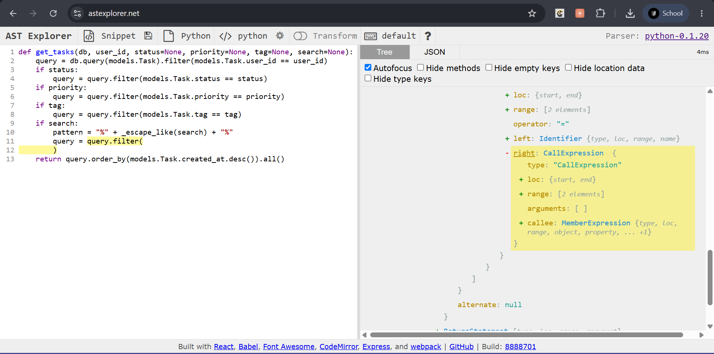
- **Interpretation:** the trace showed `get_tasks()` returning all 4
  tasks instead of 1; the AST confirmed the `if search:` branch has
  exactly one `ilike()` call chain with no sanitizing call anywhere in
  it — the bug is structural, not a one-off typo.

### 1.2 Change Management
**Tool:** Git — *why:* it's the tool for exactly this: branch, bug
report, commit history, all inherently text/diff-based, nothing else
in the toolset does this job.

- **Steps:** `git checkout -b fix/search-like-wildcard-escape`; wrote
  a bug report (what broke, how found, expected vs. actual); committed
  the fix as `f4dc3cf`.
- **Output:** `maintenance/corrective/02_change_management/bug_report.md`,
  `git_log_evidence.txt`.
- **Interpretation:** standard, low-risk change-tracking — nothing
  unusual to call out here beyond what the report already says.

### 1.3 Impact Analysis
**Tools:** Joern + Neo4j — *why:* Joern's CPG can answer "who calls
this function, anywhere in the codebase" precisely, which matters
before touching a function's behavior — you need to know the blast
radius before you can call a fix "safe."

- **Command:** `joern-parse --language pythonsrc` over the backend,
  then a CPGQL query for `cpg.method.name("get_tasks").caller`.
- **Output:**
  `[PLACE SCREENSHOT: maintenance/corrective/03_impact_analysis/neo4j_impact_analysis.png]`
  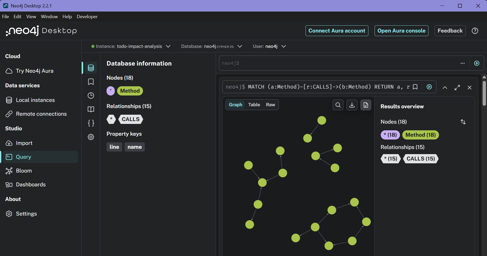
- **Interpretation:** `get_tasks()` has exactly **one** caller in the
  whole codebase — `main.read_tasks()`. The fix is fully contained to
  one HTTP endpoint; nothing else needed re-checking.

### 1.4 Reverse Engineering
**Tool:** Graphviz — *why:* once Joern has already answered "who
calls this," a small, hand/script-built call graph is the clearest way
to *show* where a fault originates and how it would propagate,
without the overhead of visualizing the entire CPG.

- **Output:**
  `[PLACE SCREENSHOT/DIAGRAM: maintenance/corrective/04_reverse_engineering/bug_callgraph.png]`
  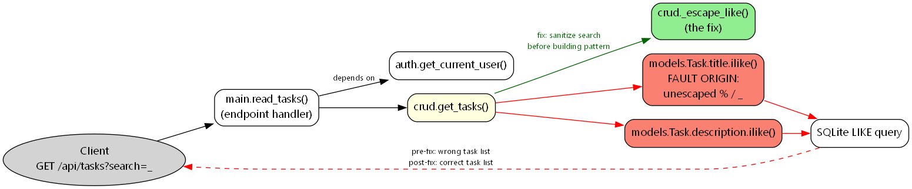
- **Interpretation:** traces the fault from the HTTP request, through
  `read_tasks` → `get_tasks` → the two `ilike()` calls (fault origin),
  down to the wrong SQL result — a one-glance picture of the whole bug.

### 1.5 Refactoring
**Tools:** SonarQube + PySnooper — *why:* PySnooper re-confirms the
*specific* bug is fixed (same edge case, now correct); SonarQube checks
the fix didn't introduce *new*, unrelated problems — two different
questions, two different tools.

- **Fix:** added `_escape_like()` + `escape="\\"` on both `ilike()`
  calls in `crud.py`.
- **Output:** PySnooper re-run table (below) +
  `[PLACE SCREENSHOT: maintenance/corrective/05_refactoring/sonarqube_result.png]`
  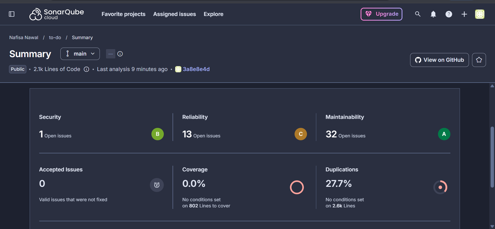

  | Input | Before fix | After fix |
  |---|---|---|
  | `search="_"` | 4/4 tasks (wrong) | **1/1 task (correct)** |
  | `search="%"` | would also over-match | **0/0 tasks (correct)** |

- **Interpretation:** this was the **first-ever** SonarQube analysis of
  the project (no prior baseline), so it reports whole-project health:
  1 security issue, 13 reliability issues, 32 maintainability issues,
  0% coverage (no test suite exists), 27.7% duplication. None of this
  is attributable to the 3-line fix itself — it became the baseline for
  every later cell to compare against.

---

## 2. Adaptive Maintenance

**Scenario.** The project's Python runtime moved to 3.12+ (this
environment runs 3.14.6), which deprecates `datetime.datetime.utcnow()`
— used in **6 places across 3 files** (`auth.py`, `crud.py`,
`models.py`) — in favor of timezone-aware `datetime.now(timezone.utc)`.
A related SQLAlchemy 2.0 deprecation (`declarative_base` moved from
`sqlalchemy.ext.declarative` to `sqlalchemy.orm`) was found and fixed
alongside it, since it surfaced as a second blocking warning while
verifying the same runtime-upgrade branch.

Branch `adapt/datetime-utcnow-upgrade` → fix commit `b177ef7` → merged
to `main`.

### 2.1 Program Comprehension
**Tools:** AST Explorer + written report — *why:* no PySnooper here
because there's no wrong *output* to trace (the old code was
functionally correct) — the question is purely "which AST nodes tie
this code to the old API," which is exactly AST Explorer's job.

- **Output:**
  `[PLACE SCREENSHOT: maintenance/adaptive/01_program_comprehension/ast_explorer_create_access_token.png]`
  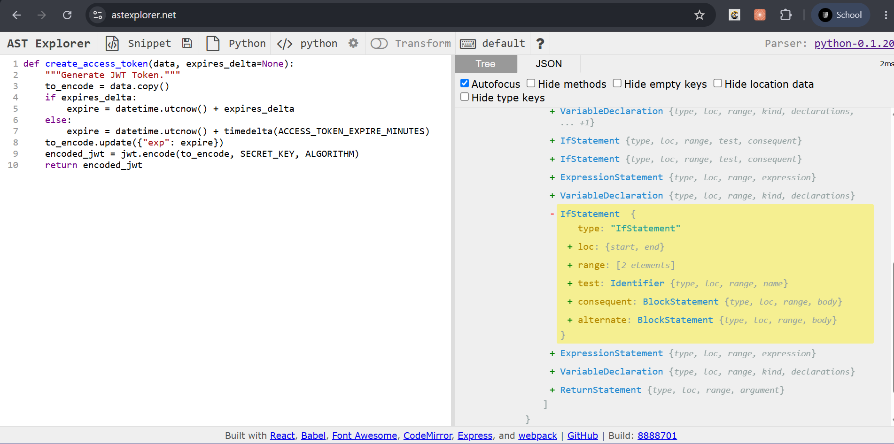
- **Interpretation:** the AST shows exactly two bare `Call` nodes to
  `datetime.utcnow()` (lines 40, 42), no timezone object attached to
  either. **Bonus finding while writing this report:** because
  `datetime.utcnow()` returns a *naive* datetime, and PyJWT converts it
  to a Unix timestamp via `.timestamp()` (which reads a naive datetime
  as *local* time, not UTC), the old code had a **latent
  timezone-correctness bug** — verified directly on this machine: a
  6-hour discrepancy between the naive-datetime timestamp and the real
  UTC epoch. This adaptation wasn't just silencing a warning, it fixed
  a real bug that would only show up on non-UTC servers.

### 2.2 Change Management
**Tool:** Git.

- **Output:** `maintenance/adaptive/02_change_management/adaptation_report.md`,
  `CHANGELOG.md`.
- **Interpretation:** no `requirements.txt` version bump was needed —
  this is a *runtime* compatibility fix, not a dependency upgrade; the
  installed package versions already supported the new APIs.

### 2.3 Impact Analysis
**Tools:** Joern + Neo4j.

- **Command:** CPG built from the **pre-fix** source (deliberately —
  impact analysis is meant to *scope* a change, not audit it after the
  fact), CPGQL query for every call site matching `.*utcnow.*`.
- **Output:**
  `[PLACE SCREENSHOT: maintenance/adaptive/03_impact_analysis/neo4j_impact_analysis.png]`
  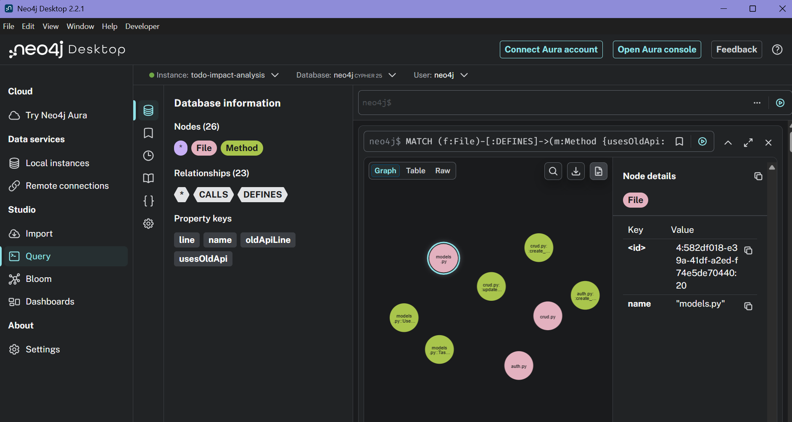
- **Interpretation:** confirmed exactly **3 files / 5 functions / 6
  call sites** — matching what was found by hand, nothing missed.

### 2.4 Reverse Engineering
**Tool:** Graphviz.

- **Output:**
  `[PLACE SCREENSHOT/DIAGRAM: maintenance/adaptive/04_reverse_engineering/migration_surface.png]`
  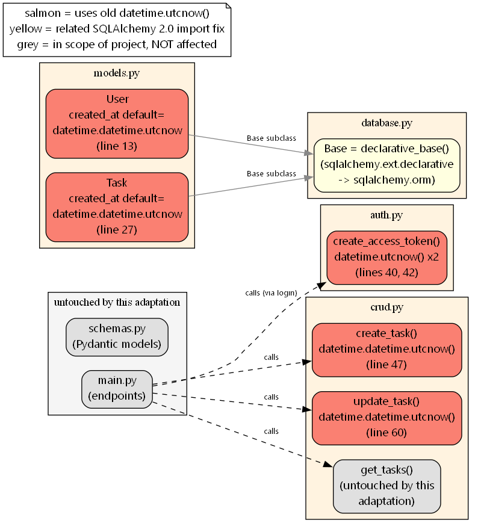
- **Interpretation:** visualizes the full migration surface (the 5
  affected functions) contrasted against untouched parts of the project
  (`main.py` endpoints, `schemas.py`, `get_tasks()`) — makes the "this
  touches exactly these 5 things and nothing else" claim visible at a
  glance.

### 2.5 Refactoring
**Tool:** SonarQube.

- **Fix:** all 6 `datetime.utcnow()` call sites migrated to
  `datetime.now(timezone.utc)`; `database.py`'s `declarative_base`
  import corrected.
- **Output:**
  `[PLACE SCREENSHOT: maintenance/adaptive/05_refactoring/sonarqube_result.png]`
  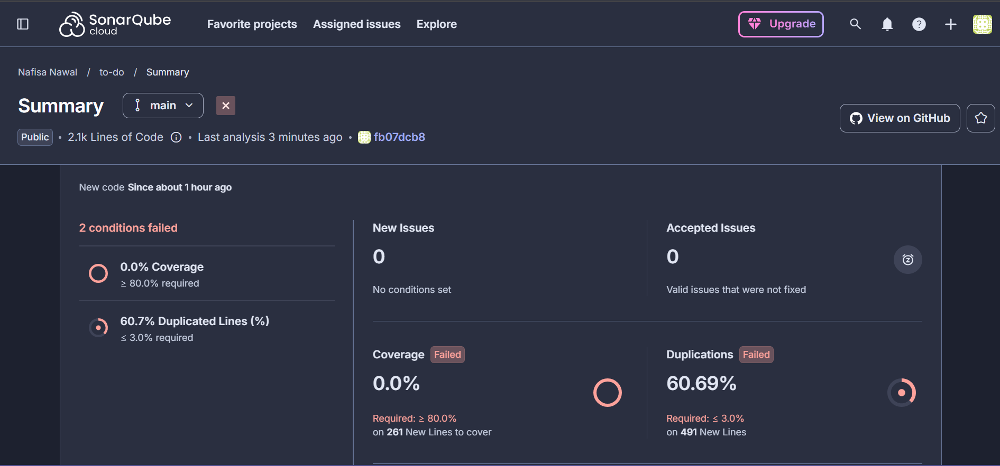

  | Condition (new code) | Result | Required |
  |---|---|---|
  | Coverage | 0.0% | ≥ 80.0% |
  | Duplicated Lines | 60.7% | ≤ 3.0% |

- **Interpretation:** both failures are explained and neither traces
  back to this adaptation. Coverage is the same pre-existing gap as the
  corrective baseline. The 60.7% duplication was traced to
  `maintenance/`'s own intentional before/after source *snapshots* fed
  to Joern being scanned as if they were production code — fixed by
  adding `sonar.exclusions=maintenance/**`, which is the fix that
  eventually dropped duplication to 0.0% by the preventive branch (see
  §3.5). No new bugs/smells in `auth.py`/`crud.py`/`models.py`/
  `database.py`, the actual files touched.

---

## 3. Preventive Maintenance

**Scenario.** No active bug — proactively looking for risky code
before it causes one. `static/app.js` (653 lines, the largest and only
untested/unstructured file in the project — no framework, no imports)
had **4 functions** (`fetchTasks`, `handleTaskSubmit`,
`toggleTaskStatus`, `deleteTask`) each independently reimplementing the
same fetch/401-check/error-handling boilerplate — exactly the kind of
duplication that causes inconsistent fixes down the line.

Branch `preventive/app-js-fetch-dedup` → fix commit `a382f21` → merged
to `main`.

### 3.1 Program Comprehension
**Tools:** Graphviz + AST Explorer + written report — *why:* Graphviz
gives the project-wide structural overview needed to *find* a risky
module in the first place (before you know what's risky, you can't
target AST Explorer at anything); AST Explorer then confirms the
specific duplication is real, not just eyeballed.

- **Output:**
  `[PLACE DIAGRAM: maintenance/preventive/01_program_comprehension/project_structure.png]`
  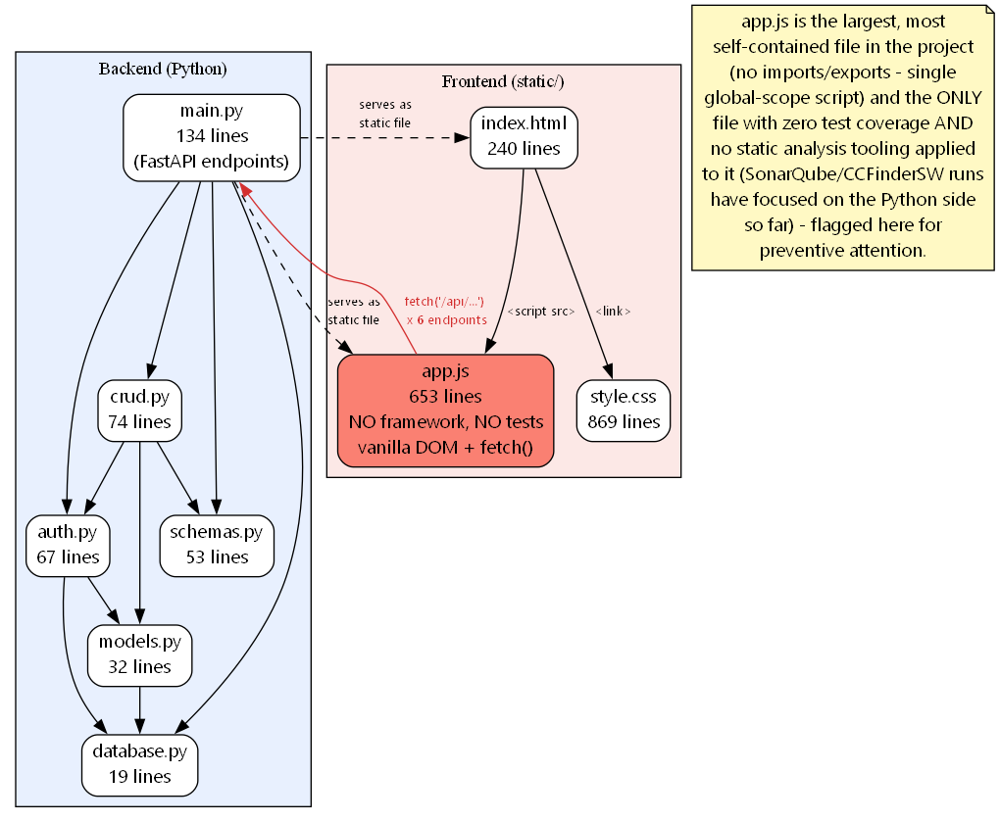
  `[PLACE SCREENSHOT: maintenance/preventive/01_program_comprehension/ast_explorer_toggleTaskStatus.png]`
  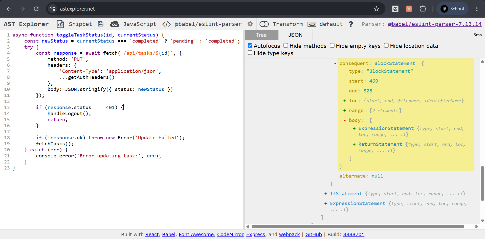
  `[PLACE SCREENSHOT: maintenance/preventive/01_program_comprehension/ast_explorer_deleteTask.png]`
  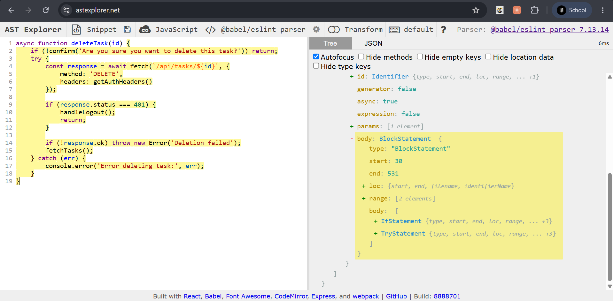
- **Interpretation:** `app.js` stands out immediately in the
  project-wide graph (largest file, no tests, no framework). The two
  AST screenshots show `toggleTaskStatus()` and `deleteTask()`
  producing the **identical** `TryStatement`/`IfStatement`/
  `CatchClause` tree shape — a real structural duplicate, not just
  similar-looking code.

### 3.2 Change Management
**Tool:** Git.

- **Output:** `maintenance/preventive/02_change_management/justification.md`.
- **Interpretation:** per the plan's cell ordering, the actual code
  change was deliberately deferred to §3.5, *after* Impact Analysis and
  clone detection quantified the duplication with tooling rather than
  just by eye.

### 3.3 Impact Analysis
**Tools:** SonarQube + Neo4j (via Joern) — *why:* Joern's JS frontend
(`jssrc2cpg`) can quantify exactly how central each duplicated function
is (call fan-out, who calls whom) — turning "this looks duplicated"
into "these 4 functions, confirmed, here's the call graph."

- **Command:** CPG for `app.js` alone via `jssrc2cpg`; CPGQL query for
  every function that calls `handleLogout()` (the 401-handling branch).
- **Output:**
  `[PLACE SCREENSHOT: maintenance/preventive/03_impact_analysis/neo4j_impact_analysis.png]`
  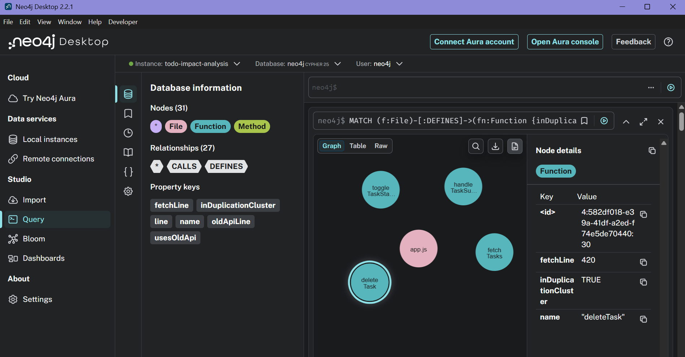
- **Interpretation:** the CPG query **refined** the comprehension
  finding from 3 to **4** duplicated functions — `fetchTasks()` itself
  turned out to share the identical shape too, something the manual
  reading had missed. This is exactly the value tooling adds over
  reading alone.

### 3.4 Reverse Engineering
**Tool:** CCFinderSW — *why:* the plan calls for dedicated clone
detection here, and CCFinderSW is a real, published, token-based clone
detector (Kamiya et al., cited in the accompanying lab material) — the
right category of tool for "find duplicated logic blocks," distinct
from Joern's structural/call-graph analysis.

- **Command:**
  `CCFinderSW.bat D -d js_as_java -l java -o appjs_clones -ccfsw pair -t 30`
  (the `.java` extension trick was necessary — CCFinderSW filters
  candidate files by extension, and this install has no native
  JavaScript ruleset; Java's brace/semicolon/comment syntax tokenizes a
  `.js` file's shape closely enough to work).
- **Output:**
  `[PLACE SCREENSHOT: maintenance/preventive/04_reverse_engineering/ccfindersw_result.png]`
  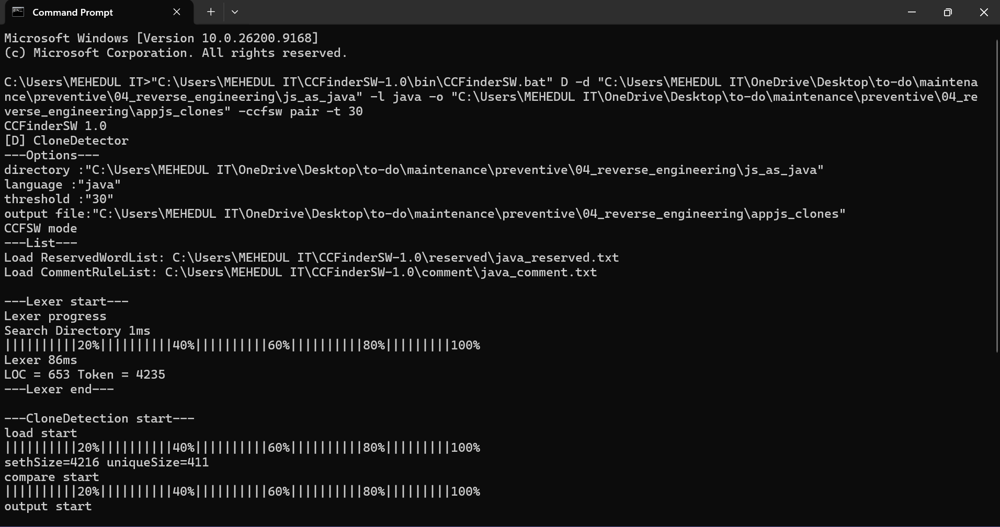
- **Interpretation:** 132 clone-pair entries found. The meaningful ones
  (a 4-way clique across `fetchTasks`/`handleTaskSubmit`/
  `toggleTaskStatus`/`deleteTask`) **independently confirm** — via pure
  token-based analysis, with zero knowledge of the AST/CPG findings —
  the exact same 4 functions. Three independent tools converging on the
  same answer. A bonus, explicitly out-of-scope finding also surfaced
  (`handleLogin`/`handleRegister` share structure too), flagged for a
  future pass rather than pulled into this branch.

### 3.5 Refactoring
**Tools:** SonarQube (verification) + CCFinderSW (re-run) — *why:*
CCFinderSW re-run proves the *targeted* duplication is actually gone
(not just "we added a helper and hope"); SonarQube re-run proves
nothing new broke project-wide.

- **Fix:** extracted a shared `apiRequest()` helper; rewired all 4
  functions to use it.
- **Output:**
  `[PLACE SCREENSHOT: maintenance/preventive/05_refactoring/sonarqube_result.png]`
  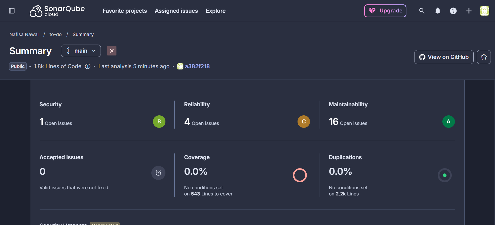

  | Metric | Corrective-branch baseline | Preventive branch (after fix) |
  |---|---|---|
  | Security | 1 open issue | 1 open issue |
  | Reliability | 13 open issues | **4** open issues |
  | Maintainability | 32 open issues | **16** open issues |
  | Duplications | 27.7% | **0.0%** |
  | CCFinderSW: pairwise matches among the 4 target functions | 5 of 6 possible | **1** (trivial residual) |

- **Interpretation:** `fetchTasks` and `handleTaskSubmit` now have
  **zero** clone matches with anything in the cluster. The one
  remaining match (`toggleTaskStatus`↔`deleteTask`) is just the shared
  3-line tail after calling the helper (`if (!response) return;
  fetchTasks();`), not the risky duplicated auth/error logic that
  justified the branch — that logic now lives in exactly one place.
  Duplication dropping to 0.0% is partly this fix, partly the
  `sonar.exclusions` fix from §2.5 finally taking full effect.

---

## 4. Perfective Maintenance

**Scenario.** Not broken — `crud.get_tasks()` (and `get_task()`)
return correct results for every filter today. But
`Task.user_id`/`.status`/`.priority`/`.tag` are all filtered on
without a database index, so every call does a full table scan. Not a
problem yet at the app's current scale, worth fixing proactively before
it is. (Reducing PBKDF2's iteration count on password hashing was
considered and rejected as a "performance win" — that would be a
security regression, not an optimization, so a different, safe target
was chosen instead.)

Branch `perfective/get-tasks-query-indexing` → fix commit `e4ba116` →
merged to `main`.

### 4.1 Program Comprehension
**Tools:** Viztracer + AST Explorer + written report — *why:*
Viztracer gives a call-timeline view of where time actually goes inside
one `get_tasks()` call (useful for a first "what's even happening
here" look); AST Explorer then structurally confirms exactly which
parameters become `WHERE`-clause equality filters (the indexing
candidates), separate from `search`'s `LIKE` pattern which can't
benefit from a plain index the same way.

- **Command:** seeded a realistic 20,000-row benchmark dataset (50
  users × 400 tasks) into an isolated SQLite file, traced one
  representative `get_tasks()` call with Viztracer.
- **Output:**
  `[PLACE SCREENSHOT: maintenance/perfective/01_program_comprehension/ast_explorer_get_tasks.png]`
  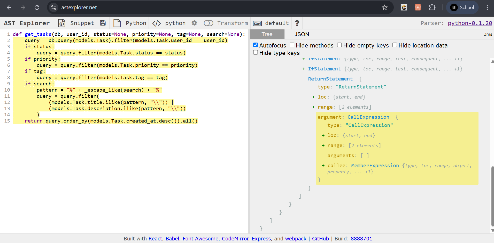
- **Interpretation:** `sqlite3.Cursor.execute` + SQL compilation
  together accounted for the bulk of a 7.5ms traced call — on an
  unindexed table. The AST confirmed structurally that `user_id`,
  `status`, `priority`, `tag` all get plain equality filters (index
  candidates), while `search` gets an `ilike()` pattern (not the same
  kind of candidate).

### 4.2 Change Management
**Tool:** Git.

- **Output:** `maintenance/perfective/02_change_management/enhancement_request.md`.
- **Interpretation:** the actual index-adding change was deferred to
  §4.5, after Impact Analysis confirmed it was safe and the
  cProfile/Snakeviz pass pinpointed exactly which part of the call was
  the bottleneck.

### 4.3 Impact Analysis
**Tools:** Joern + Neo4j.

- **Command:** fresh CPG from the merged `main`; CPGQL query for
  callers of `get_tasks()` and every reference to the 4 columns
  proposed for indexing.
- **Output:**
  `[PLACE SCREENSHOT: maintenance/perfective/03_impact_analysis/neo4j_impact_analysis.png]`
  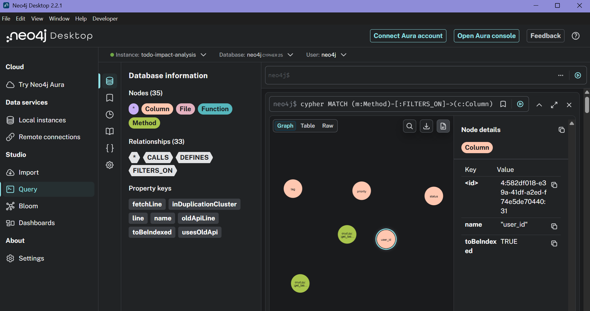
- **Interpretation:** `get_tasks()` still has exactly one caller
  (`main.read_tasks`) — unchanged from §1.3. **Bonus finding:**
  `get_task()` (singular) also filters on `user_id`, so it gets the
  same speed-up for free. No semantic risk: indexes change lookup
  speed, never query results, so nothing could behave differently.

### 4.4 Reverse Engineering
**Tools:** cProfile + Snakeviz — *why:* Viztracer (§4.1) shows a
call-timeline overview; cProfile gives exact call-count/timing numbers
needed to say precisely *how much* of the time is the database layer
versus everything else; Snakeviz turns the resulting `.prof` file into
an interactive flame graph.

- **Command:** profiled 60 representative `get_tasks()` calls (20
  users × 3 filter combinations) against the same benchmark dataset.
- **Output (sorted by self time):**
  ```
     ncalls  tottime  percall  cumtime  percall filename:lineno(function)
         61    0.087    0.001    0.087    0.001 {method 'execute' of 'sqlite3.Cursor' objects}
      12517    0.025    0.000    0.080    0.000 sqlalchemy/orm/loading.py:1068(_instance)
      12517    0.020    0.000    0.020    0.000 sqlalchemy/orm/loading.py:1329(_populate_full)
         60    0.018    0.000    0.018    0.000 {method 'fetchall' of 'sqlite3.Cursor' objects}
  ```
  `[OPTIONAL SNAKEVIZ SCREENSHOT: maintenance/perfective/04_reverse_engineering/snakeviz_result.png — not collected, text summary above covers the same finding]`
- **Interpretation:** `sqlite3.Cursor.execute` alone is 0.087s of the
  0.301s total (**29%**) — the single largest self-time contributor by
  a wide margin, confirming with call-count precision that the
  bottleneck is the database layer, not `get_tasks()`'s own Python
  logic (0.001s total self time across all 60 calls).

### 4.5 Refactoring
**Tools:** Loguru (verification) + cProfile/Snakeviz (re-check) —
*why:* Loguru confirms the migration logic itself behaves correctly
(fires only when needed, silent when already applied) — a different
kind of correctness check than "is it faster," which is what the
cProfile re-run answers.

- **Fix:** `index=True` on the 4 columns in `models.py`; a migration
  helper `ensure_task_indexes()` in `main.py` so an **existing**
  `todo.db` gets retrofitted, not just fresh databases.
- **Output:**

  | | Before | After | Change |
  |---|---|---|---|
  | Total wall time (60 calls) | 0.301s | 0.245s | **-19%** |
  | `sqlite3.Cursor.execute` self time | 0.087s | 0.063s | **-28%** |
  | `get_tasks()` self time | 0.001s | ~0.001s | unchanged (expected) |

- **Interpretation:** a real, measured, but honestly **modest**
  improvement — not a dramatic speedup, and reported as such rather
  than oversold. SQLite was already reasonably fast at 20,000 rows; the
  gap widens as the table grows further, which is the actual point of
  doing this proactively. Loguru confirmed the migration fires exactly
  4 times on a legacy unindexed DB and zero times on a re-run —
  correct and idempotent.

---

## Consolidated results

| Branch | Commit | Real bug/finding | Verified fix |
|---|---|---|---|
| `fix/search-like-wildcard-escape` | `f4dc3cf` | LIKE-wildcard injection in search (wrong results, not a crash) | PySnooper: 4/4→1/1 correct; SonarQube baseline established |
| `adapt/datetime-utcnow-upgrade` | `b177ef7` | Deprecated `datetime.utcnow()` (6 sites) + latent JWT-expiry timezone bug (6h discrepancy) | 0 targeted deprecation warnings remain; both issues fixed together |
| `preventive/app-js-fetch-dedup` | `a382f21` | 4-function fetch/401/error-handling duplication in `app.js` | CCFinderSW: 5/6 pairwise matches → 1 trivial; SonarQube duplication 27.7%→0.0% |
| `perfective/get-tasks-query-indexing` | `e4ba116` | Unindexed columns on every `get_tasks()`/`get_task()` call | cProfile: -19% wall time, -28% on the actual bottleneck |

## Reflections

Working through all 4 categories back to back on the same real
codebase made the differences between them concrete rather than
theoretical: corrective and adaptive both start from "something is
provably wrong" (a wrong output, a deprecation warning) and the tools
are about proving the fix is complete and safe; preventive and
perfective both start from "nothing is wrong yet" and the tools are
about *finding* something worth fixing in the first place (duplication,
an unindexed hot path) and then honestly measuring whether the fix was
worth it. The corrective fix's SonarQube run doubling as the
project-wide baseline, which the adaptive branch's duplication spike
and fix then explained and resolved, and which the preventive branch's
0.0% duplication result then depended on, is a good example of how
these branches weren't run in isolation — later cells kept building on
and correcting earlier ones, the way real maintenance history does.
